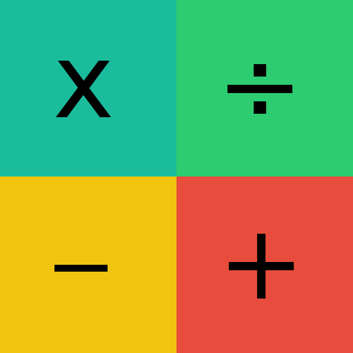
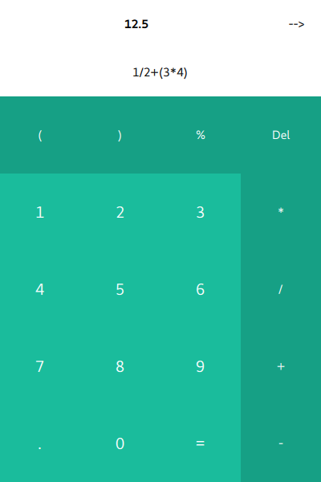
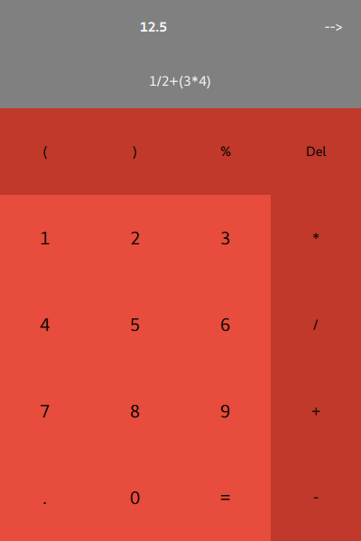
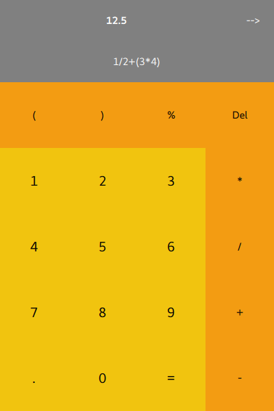

# CalQ

## Introduction
This is a simple calculator that I wrote when I first started with Qt and QML. it calculates the answer using javascipt's eval function and it has some predefined themes that you can enjoy

## Building
just load the project using the .pro file into qt creator and run it

## Built With
* [Qt](http://qt.io/) - The framework used to write the application

## License
This project is licensed under the GPL_V3 License - see the [LICENSE.md](LICENSE.md) file for details

## Preview

